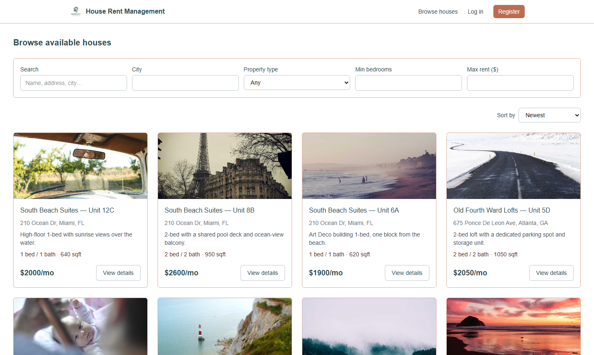
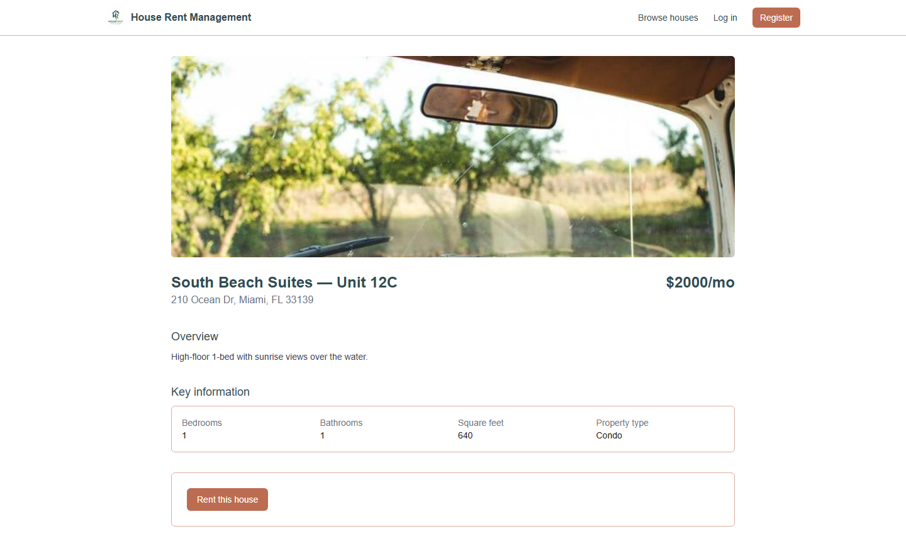
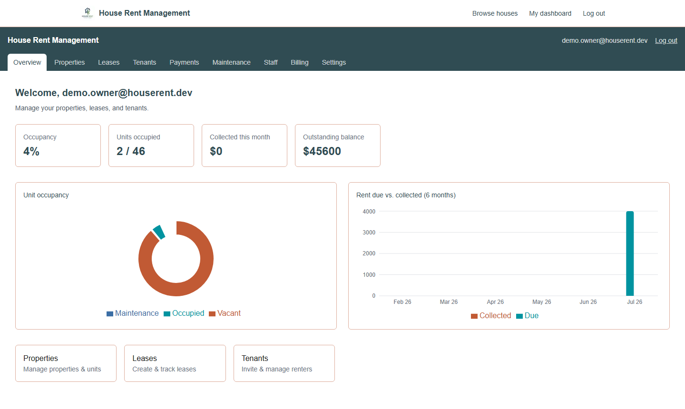
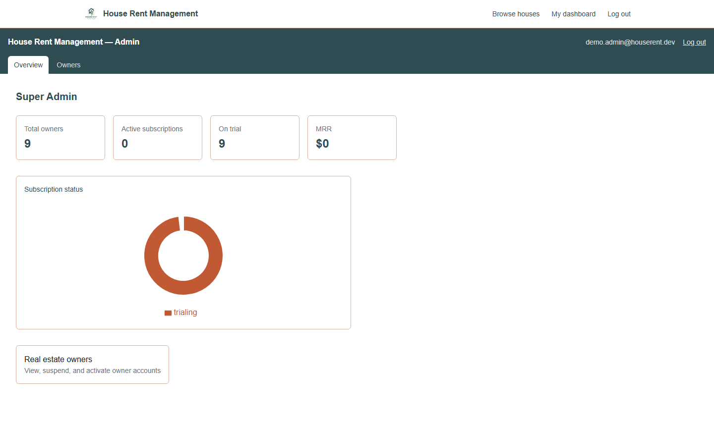
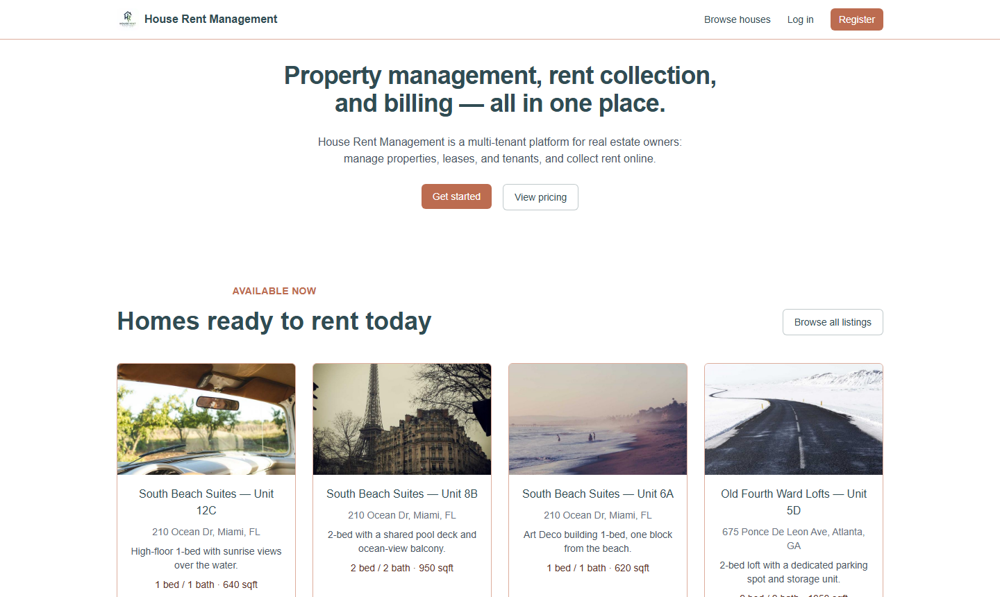

# House Rent Management

**A multi-tenant property management & rent collection SaaS** — real estate owners manage their properties, units, leases, and tenants from one dashboard; renters browse and rent listed homes and pay rent online; a platform admin oversees every owner account. Subscription billing and rent payments both run on Stripe.

[](https://house-rent-management1357.vercel.app)


---

## Live Demo

| | |
|---|---|
| **Frontend** | https://house-rent-management1357.vercel.app |
| **Backend API** | https://house-rent-management-backend-9j0r.onrender.com |

Browsing available homes (`/listings`) requires no account at all. To see the owner/admin side:

| Role | Email | Password |
|---|---|---|
| Owner | `demo.owner@houserent.dev` | `DemoOwner123!` |
| Super Admin | `demo.admin@houserent.dev` | `DemoAdmin123!` |

The `/login` page also has a one-click **"Demo login (owner)"** button that fills these in automatically.

---

## Screenshots

| Public listings | Listing details |
|---|---|
|  |  |

| Owner dashboard | Super Admin dashboard |
|---|---|
|  |  |



---

## Features

**Public / anonymous**
- Browse and filter available rental listings (city, property type, bedrooms, max rent) with sorting and pagination — no account required
- View full listing details, including related listings nearby
- One click to rent a listed home — redirects to registration if not signed in, then completes the lease instantly on signup

**Property owners**
- Multi-property, multi-unit portfolio management with full CRUD
- Lease creation and tenant invitations (email-token accept-invite flow)
- Automatic monthly rent generation with configurable late fees
- Owner-facing analytics: occupancy breakdown and a 6-month rent due-vs-collected trend, both charted
- Stripe Billing subscription (trial → paid plan, tiered `Plan` limits) managed via Stripe's hosted billing portal
- Stripe Connect onboarding to receive rent payouts directly, plus manual cash/check recording as a fallback
- Staff accounts with a restricted permission set

**Renters**
- Self-service registration ("Find a house to rent") — no invite required
- Renter portal: current lease, full payment history, printable receipts
- Pay rent online via Stripe, or via a "simulate payment" dev/demo path when Connect isn't fully onboarded

**Super Admin**
- Cross-tenant visibility: list, suspend, and reactivate any owner account
- Platform analytics: total owners, active/trialing subscriptions, MRR by plan, subscription-status breakdown

**Cross-cutting**
- Strict multi-tenancy: every owner-scoped query is filtered server-side by the `ownerId` in the JWT — never a client-supplied value
- JWT access tokens + httpOnly refresh cookies, role-guarded route groups (`admin` / `dashboard` / `portal`)
- Stripe webhooks (not client redirects) are the single source of truth for payment/subscription state
- Audit logging on sensitive mutations

---

## Tech Stack

| Layer | Technology |
|---|---|
| Frontend | Next.js 16 (App Router) · React 19 · TypeScript · Tailwind CSS 4 · Recharts · React Hook Form + Zod |
| Backend | Node.js · Express 5 · TypeScript · official `mongodb` driver (no ODM) · Zod validation |
| Database | MongoDB Atlas |
| Payments | Stripe Billing (owner subscriptions) + Stripe Connect (renter → owner rent payments) |
| Auth | JWT (access token + httpOnly refresh cookie), bcrypt password hashing |
| Hosting | Frontend on Vercel · Backend on Render |

---

## Monorepo Layout

```
house-rent-management/
├── backend/          Express + TypeScript REST API
│   └── src/
│       ├── config/       env loading & validation
│       ├── db/           MongoClient singleton + typed collection getters
│       ├── models/       plain TS interfaces (document shapes, no ODM)
│       ├── controllers/  request handlers
│       ├── routes/       Express routers
│       ├── middleware/   auth, owner-scoping, error handling
│       ├── services/     Stripe, payment generation, email
│       ├── validators/   Zod schemas per route
│       ├── webhooks/     Stripe webhook handler
│       └── scripts/      seed scripts (admin, plans, demo data)
├── frontend/          Next.js App Router + TypeScript
│   └── src/
│       ├── app/          (marketing) · (auth) · admin · dashboard · portal · listings · items
│       ├── components/   ui primitives, layout navs, auth guards
│       ├── lib/           typed API client, auth context
│       └── types/        types mirroring the backend models
├── docs/screenshots/  README images
├── plan.md            Full architecture, data model, and API surface
├── TASKS.md           Phase 0-5 implementation checklist (MVP)
├── plan2.md           Public listings + self-service rental feature plan
└── TASKS2.md          Phase 6 implementation checklist
```

Two independently deployable apps sharing one repo for atomic commits. Every owner-scoped MongoDB collection carries an `ownerId` field, and `backend/src/middleware/scopeToOwner.ts` is the single choke point that injects it from the JWT on every request — see `CLAUDE.md` for the full list of fixed architectural constraints.

---

## Getting Started

**Prerequisites:** Node.js 20+, a MongoDB Atlas cluster, a Stripe account (test mode is fine).

```bash
git clone https://github.com/abdullahazmir/house-rent-management.git
cd house-rent-management
npm install                      # root only, installs `concurrently`
npm install --prefix backend
npm install --prefix frontend
```

Copy the env templates and fill in real values:

```bash
cp backend/.env.example backend/.env
cp frontend/.env.local.example frontend/.env.local
```

Run both apps together:

```bash
npm run dev          # backend on :4000, frontend on :3000
```

Seed some data to explore the app locally:

```bash
cd backend
npm run seed:admin -- --email=admin@example.com --password=yourpassword
npm run seed:plans
npm run seed:demo     # demo owner + 44 sample listings across 8 US cities
```

### Environment Variables

**`backend/.env`**

| Variable | Purpose |
|---|---|
| `MONGODB_URI`, `MONGODB_DB_NAME` | Atlas connection |
| `JWT_ACCESS_SECRET`, `JWT_REFRESH_SECRET` (+ `*_EXPIRES_IN`) | Token signing |
| `STRIPE_SECRET_KEY`, `STRIPE_WEBHOOK_SECRET` | Stripe API + webhook verification |
| `CLIENT_APP_URL` | Frontend origin — used for CORS **and** Stripe redirect URLs. Read once at process boot; changing it in production requires a real restart, not just a saved env var |
| `DEFAULT_TRIAL_DAYS`, `COOKIE_DOMAIN`, `PORT`, `NODE_ENV` | Misc config |

**`frontend/.env.local`**

| Variable | Purpose |
|---|---|
| `NEXT_PUBLIC_API_URL` | Backend base URL, e.g. `http://localhost:4000/api/v1` |
| `NEXT_PUBLIC_STRIPE_PUBLISHABLE_KEY` | Stripe publishable key |

---

## Available Scripts

| Location | Command | Description |
|---|---|---|
| root | `npm run dev` | Both apps concurrently |
| `backend/` | `npm run dev` | API with hot reload |
| `backend/` | `npm run build` / `npm start` | Type-check, compile, run compiled output |
| `backend/` | `npm run lint` | ESLint |
| `backend/` | `npm run seed:admin` / `seed:plans` / `seed:demo` | Seed scripts (see above) |
| `frontend/` | `npm run dev` | Next.js dev server |
| `frontend/` | `npm run build` / `npm start` | Production build / serve |
| `frontend/` | `npm run lint` | ESLint |

---

## Deployment

- **Frontend** deploys to **Vercel** from the `frontend/` directory.
- **Backend** deploys to **Render** as a standard Node web service from `backend/`.
- Stripe webhooks are verified via `express.raw()` mounted *before* the global JSON body parser — this ordering is load-bearing.
- `CLIENT_APP_URL` on the backend must exactly match the frontend's production origin (no trailing slash) for CORS to allow browser requests; see the note above about restarts.

---

## Project Documentation

| File | Contents |
|---|---|
| [`plan.md`](plan.md) | Full data model, API surface, auth flow, and billing/payment design |
| [`TASKS.md`](TASKS.md) | Phase 0–5 granular task checklist (core MVP) |
| [`plan2.md`](plan2.md) | Public listings catalog + self-service rental feature design |
| [`TASKS2.md`](TASKS2.md) | Phase 6 task checklist (listings, charts, demo login) |
| [`CLAUDE.md`](CLAUDE.md) | Fixed architectural constraints and conventions for this codebase |
